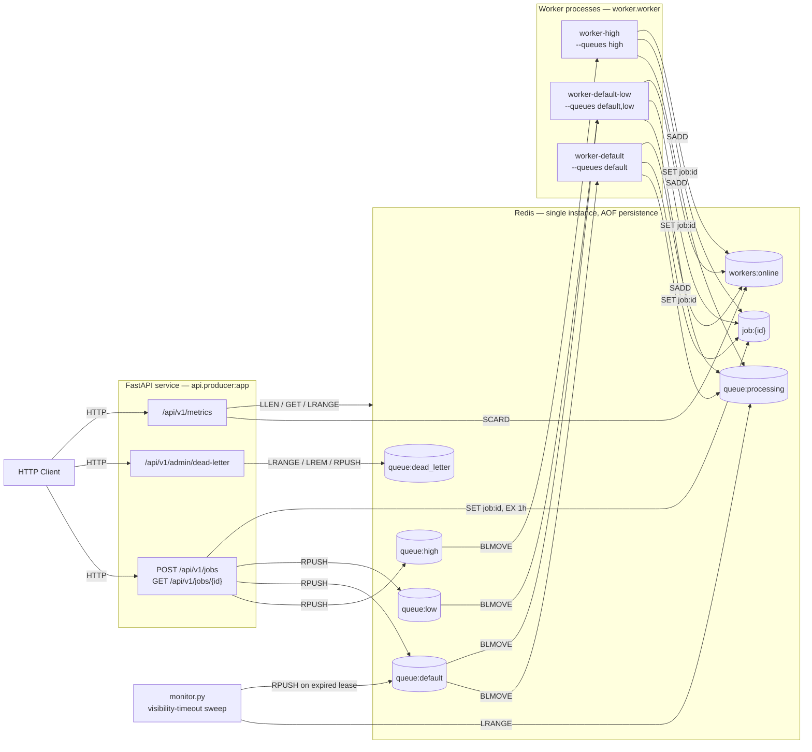
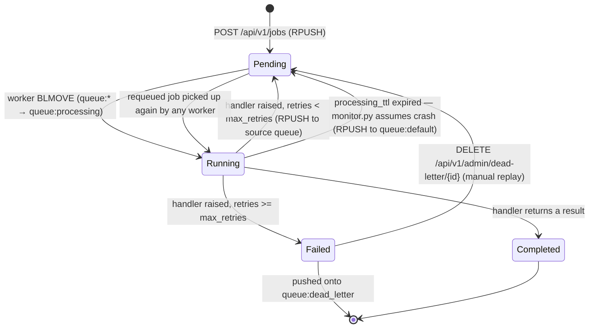
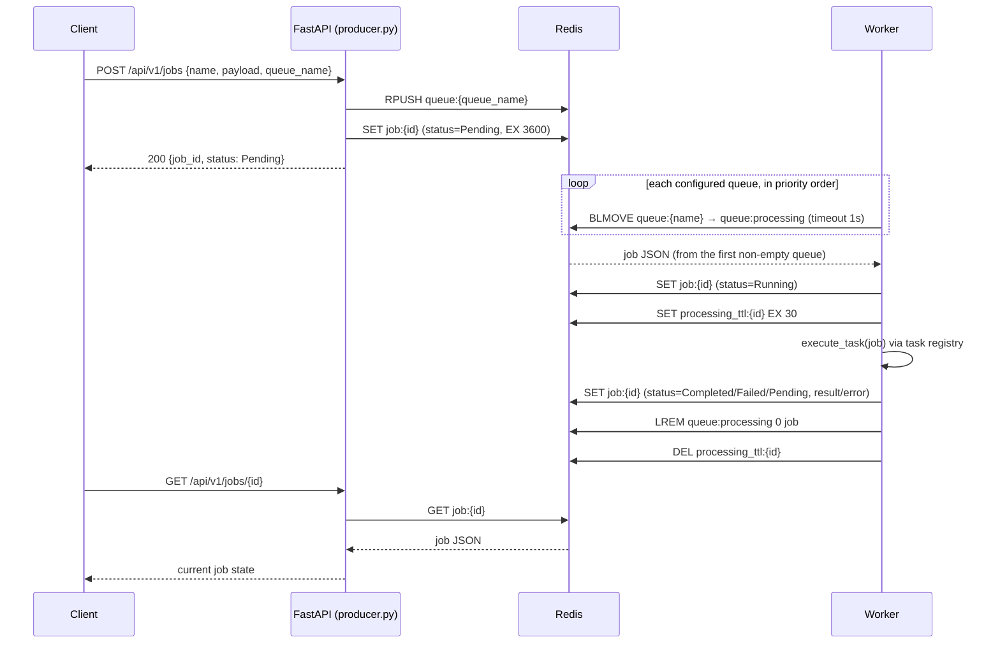

# Distributed Job Queue & Task Execution Engine

A Redis-backed job queue with a FastAPI producer and pool-based Python workers. Clients submit named jobs with a JSON payload over HTTP; workers pull jobs off priority-ordered Redis lists, execute a registered handler, and report status, retries, and failures back through the same Redis state that the API reads. There is no external broker, no ORM, and no scheduler — Redis is the only moving infrastructure piece besides the API and worker processes themselves.

This is an educational implementation, not a fork of an existing queue library. It is built directly on `redis-py` (no Celery, no RQ) to make the queueing mechanics — blocking pops, atomic pop-and-requeue, visibility timeouts, dead-lettering — visible in the source rather than hidden behind a framework.

## Motivation

Web requests need to return quickly. Anything that doesn't — sending an email, resizing an image, calling a slow third-party API, running a report — has to happen somewhere else, on its own schedule, with its own failure handling. That "somewhere else" is a job queue: a durable handoff point between "the client asked for this" and "a worker actually did it," decoupled enough that either side can be slow, restart, or scale independently of the other.

This project builds that handoff point from first principles on top of Redis, rather than adopting an existing task-queue library, in order to work through the actual hard parts directly:

- What happens when a worker dies mid-job?
- How do you stop a slow job from being picked up twice?
- How do you give some jobs priority over others without a separate scheduler?
- What do you actually measure to know if the system is healthy?

Each of those questions maps to a section below, and to a specific, small piece of code — not a framework feature taken on faith.

## Features

**Task Execution**
- Pluggable task registry (`worker/tasks.py`) — new job types are added by writing an `async def(payload: dict) -> dict` and decorating it with `@register_task("name")`; the worker loop never references task names directly.
- Jobs carry an arbitrary JSON `payload` and return an arbitrary JSON `result`.

**Worker Coordination**
- Static priority queues: each worker process is started with an ordered `--queues` list (e.g. `--queues high,default,low`) and drains them in that order.
- Worker registration and liveness via a Redis set (`workers:online`), refreshed on an interval and cleaned up on graceful shutdown.
- Graceful shutdown on `SIGTERM`/`SIGINT`: a worker stops accepting new jobs immediately but always finishes and persists the job it is currently executing before exiting.

**Reliability**
- Visibility timeout: a picked-up job is moved into a `queue:processing` list and given a short-lived `processing_ttl` key; a separate `monitor.py` process sweeps that list and requeues any job whose TTL has expired, on the assumption its worker died.
- Heartbeats: while a job's handler is running, a background task refreshes its `processing_ttl` every 10 seconds so legitimately long-running jobs are never mistaken for abandoned ones.
- Bounded retries with a dead-letter queue: a job is retried in place up to `max_retries` times, then moved to `queue:dead_letter` with its status, error, and retry count preserved.
- Manual dead-letter replay via the admin API.

**Observability**
- A single `/api/v1/metrics` endpoint exposing 15 metrics computed from live Redis state — no separate metrics store.
- Server-Sent Events endpoint for watching a single job's status transitions in near-real time.

**Infrastructure**
- Docker Compose topology demonstrating priority isolation: three worker services, each bound to a different queue set, plus Redis (AOF persistence) and a standalone monitor service.

**Developer Experience**
- Fully typed Pydantic models for job state and API request/response bodies.
- Every Redis key, TTL, and interval is a named constant at the top of its module — no magic numbers scattered through the logic.

## High Level Architecture



There is no database and no separate scheduler process. Redis holds all state: queue contents, per-job records, the dead-letter list, worker liveness, and every metric.

## Component Overview

| Component | File(s) | Responsibility |
|---|---|---|
| API (producer) | [`api/producer.py`](api/producer.py) | Accepts job submissions, enqueues them, serves job status (including SSE streaming). |
| API (admin) | [`api/admin.py`](api/admin.py) | Read and manually replay jobs sitting in the dead-letter queue. |
| API (metrics) | [`api/metrics.py`](api/metrics.py) | Aggregates and returns the current metrics snapshot. |
| Redis | — | Message broker (blocking list operations), job state store, and metrics store — all three roles, one process. |
| Worker | [`worker/worker.py`](worker/worker.py) | Pulls jobs off its configured queues, executes them via the task registry, handles retries/dead-lettering, reports timing metrics. |
| Task registry | [`worker/tasks.py`](worker/tasks.py) | Maps a job's `name` to the handler that executes it. |
| Monitor | [`worker/monitor.py`](worker/monitor.py) | The closest thing this project has to a scheduler — it does not schedule anything; it periodically reclaims jobs whose worker appears to have died. |
| Shared core | [`core/schemas.py`](core/schemas.py), [`core/redis_client.py`](core/redis_client.py), [`core/metrics.py`](core/metrics.py) | The `Job` model, a thin async Redis client wrapper, and metrics-recording helpers shared by the API and worker processes. |

There is intentionally no scheduler component (no cron, no delayed/recurring jobs) and no external database — see [Design Decisions](#design-decisions) for why.

## Job Lifecycle



Two details that are easy to miss reading the diagram alone:

- `max_retries` (default 3) bounds total *attempts*, not additional retries after the first. A job's `retries` counter is incremented on the first failure too, so `max_retries=3` means at most 3 executions, not 4.
- Crash recovery (the `processing_ttl` expiry path) and exception-triggered retry are two different code paths with different bookkeeping: a crash-recovered job's `retries` counter is untouched, since it never actually finished executing.

## Request Flow



## Worker Lifecycle

| Phase | Mechanism |
|---|---|
| **Registration** | On startup, a worker `SADD`s `socket.gethostname()` into `workers:online`, then refreshes that membership every 10 seconds ([`_register_worker_loop`](worker/worker.py)). |
| **Task acquisition** | The worker tries `BLMOVE` against each configured queue in order, one at a time, each with a 1-second timeout. The first queue to return a job wins; this is how priority is enforced (see [Queue Design](#queue-design)). |
| **Heartbeat / lease renewal** | Once a job is picked up, `processing_ttl:{id}` is set with a 30-second expiry. A background task refreshes it every 10 seconds for as long as the job's handler is still running. |
| **Completion** | On success, status becomes `Completed`, the result is stored, and the job is removed from `queue:processing`. |
| **Failure** | On an exception, `retries` is incremented. Below `max_retries` the job goes back to `Pending` and is `RPUSH`ed onto the same queue it came from (so a retried high-priority job isn't silently demoted). At `max_retries` it becomes `Failed` and is pushed to `queue:dead_letter`. |
| **Recovery** | Handled by a separate process, not the worker itself — see below. |
| **Shutdown** | `SIGTERM`/`SIGINT` sets an `asyncio.Event`. The worker stops picking up *new* jobs but always finishes whatever job it's currently running, persists its final state, and only then deregisters and exits. |

Recovery is deliberately not part of the worker's own lifecycle — a dead worker cannot recover its own jobs. That is `monitor.py`'s entire job: every 10 seconds, it scans `queue:processing`, and for any job whose `processing_ttl` key no longer exists, it assumes the worker that picked it up is gone, `RPUSH`es the job back onto `queue:default`, and removes the stale copy from `queue:processing`.

## Queue Design

Each priority level is a separate Redis list — `queue:high`, `queue:default`, `queue:low` — populated with `RPUSH` and consumed with `BLMOVE`. There is no single global priority queue; priority is an emergent property of *which lists a given worker is configured to drain, and in what order*, not a priority field on the job itself.

**Why `BLMOVE` instead of `BLPOP` or `LPOP`:**

`BLMOVE source dest timeout LEFT LEFT` atomically pops from `source` and pushes onto `dest` in one round trip. That closes a real gap this project hit during development: an earlier version used `BLPOP` followed by a separate `LPUSH` into `queue:processing`, which left a window where a crash between the two calls would lose the job's visibility-timeout tracking entirely. `BLMOVE` removes that window at the cost of only accepting a single source key — see the trade-off below.

**Why sequential per-queue polling, not one call across all queues:**

Plain `BLPOP` accepts multiple keys and blocks on all of them at once, returning from whichever becomes non-empty first — genuinely instant priority dispatch. `BLMOVE` does not support multiple source keys. This project's worker loop therefore tries each configured queue in turn, each with a short (1 second) timeout. The consequence: if `queue:high` is empty, the worker blocks on it for up to a second even if `queue:default` already has work waiting. Atomicity was chosen over that latency; it is a real, measured trade-off, not an oversight.

**Redis structures in use:**

| Structure | Type | Purpose |
|---|---|---|
| `queue:{name}` | List | FIFO job queue per priority level. |
| `queue:processing` | List | Jobs currently claimed by a worker (in flight). |
| `queue:dead_letter` | List | Jobs that exhausted `max_retries`. |
| `job:{id}` | String (JSON) | The full `Job` record, with a 1-hour TTL. |
| `processing_ttl:{id}` | String | Visibility-timeout lease for one in-flight job; existence, not value, is what matters. |
| `workers:online` | Set | Hostnames of currently-registered workers. |
| `metrics:*` | Counters, capped lists, one sorted set | See [Metrics](#metrics). |

FIFO ordering within a single queue relies on `RPUSH` (producer) paired with `BLMOVE ... LEFT` (consumer) — push to the tail, pop from the head.

## Reliability

| Concern | How it's handled | Caveat |
|---|---|---|
| Worker crash mid-job | `monitor.py` reclaims the job once its `processing_ttl` lapses (≤30s after the last heartbeat). | Recovery always requeues to `queue:default`, not the job's original queue — a crashed high-priority job loses its priority on recovery. |
| Slow-but-alive job | Heartbeat refreshes `processing_ttl` every 10 seconds while the handler runs, well inside the 30-second lease. | The heartbeat is an `asyncio` task on the same event loop as the handler. A handler that blocks the loop (CPU-bound work without yielding) will also starve its own heartbeat, and can trigger a false crash-detection. Handlers are expected to be `async` and non-blocking. |
| Repeated transient failure | Retried up to `max_retries` times, then dead-lettered. | Retries are requeued immediately, with no backoff or jitter. |
| Manual replay of a dead-lettered job | `DELETE /api/v1/admin/dead-letter/{id}` moves it back to `Pending` on `queue:default`. | The job's `retries` counter is not reset, so a replayed job that fails again goes straight back to `Failed` after a single attempt. |
| Duplicate execution | Not prevented. | This system is at-least-once, not exactly-once. A job stuck long enough to trip the visibility timeout can be picked up by a second worker while the first is still finishing. Task handlers must be idempotent if this matters for a given job type. |
| Idempotent job submission | Not implemented. | Two identical `POST /api/v1/jobs` calls (e.g. a client retry) create two independent jobs with different UUIDs. There is no submission-side dedup key. |
| `monitor.py` itself failing | Not handled. | It is a single, unreplicated process. If it is down, orphaned jobs simply wait in `queue:processing` until it restarts, at which point the next sweep reclaims them immediately regardless of how long they'd been waiting. |

## Metrics

Everything below is served from a single `GET /api/v1/metrics` call, computed live from Redis on every request — there is no separate metrics database or background aggregation job.

| Metric | Description | Status |
|---|---|---|
| Queue Depth | `LLEN` per known queue (`default`, `high`, `low`). Fixed list rather than `SCAN`-discovered, because an empty queue has no Redis key at all and would otherwise be silently omitted. | Implemented |
| Active Workers | `SCARD workers:online`. | Implemented |
| Worker Utilization (%) | `min(len(queue:processing) / active_workers, 1.0) * 100` — approximates "workers currently busy" from in-flight job count, since no per-worker busy/idle state is tracked directly. | Implemented (approximation) |
| Jobs Completed (Total) | Cumulative counter, incremented on every successful terminal completion. | Implemented |
| Jobs Failed (Total) | Cumulative counter, incremented only when a job reaches terminal `Failed` (i.e. exhausts retries) — not on every transient failure. | Implemented |
| Retry Count (Jobs Retried Total) | Cumulative counter, incremented on every caught exception, whether or not that attempt leads to a final failure. | Implemented |
| Dead Letter Queue Size | `LLEN queue:dead_letter`. | Implemented |
| Average Queue Wait Time | Mean of a capped (1000-entry) sample list of `pickup_time - created_at`, recorded on every job pickup. | Implemented |
| Average Execution Time | Mean of a capped sample list of wall-clock time spent inside the task handler. | Implemented |
| P95 Job Latency | 95th percentile of end-to-end `completed_time - created_at`, recorded on every terminal outcome. | Implemented |
| Throughput (Jobs/min) | Count of completions in the trailing 60-second window (Redis sorted set, pruned on read), scaled to a per-minute rate. | Implemented |
| Jobs Processed/sec | Same trailing-window count divided by the window size in seconds. | Implemented |
| Queue Publish Latency | Mean wall-clock time of the `RPUSH` call in the producer, per submitted job. | Implemented |
| Queue Consume Latency | Mean wall-clock time of the specific `BLMOVE` call that returned a job. If the queue was empty and the call blocked waiting, that wait is included — this measures "time to pick up a job," not a pure Redis round trip. | Implemented (see caveat) |
| System Uptime | `now - metrics:system_start_time`, a shared timestamp set once (`SET ... NX`) by whichever process — API or worker — starts first. | Implemented |
| Running Jobs | Count of jobs currently in `queue:processing`. Computed internally for Worker Utilization but not exposed as its own field. | Future Metric |
| Idle Workers | `active_workers - busy_workers`. | Future Metric |
| Scheduled Jobs | No delayed/recurring job concept exists. | Not Applicable |
| Jobs Submitted Total | Not currently counted independently of the publish-latency sample. | Future Metric |
| Worker Heartbeats (last-seen per worker) | Worker registration exists (`workers:online`), but there is no per-worker last-seen timestamp — only aggregate membership. | Future Metric |
| Average Job Latency | The same sample set used for P95 Job Latency is not currently also surfaced as a mean. | Future Metric (trivial to add — samples already collected) |
| P50 / P99 Latency | `core/metrics.percentile()` supports an arbitrary percentile; only `p=0.95` is currently wired into the endpoint. | Future Metric |
| Task Completion Rate (%) | `jobs_completed / (jobs_completed + jobs_failed)` is not currently computed. | Future Metric |
| Redis Latency / Redis Memory | No `INFO` polling against Redis itself. | Future Metric |
| API Latency | No per-request instrumentation on the FastAPI layer (only the `RPUSH` inside one handler is timed). | Future Metric |
| CPU / Memory Usage | No process-level resource sampling. | Future Metric |
| Scheduling Delay / Task Dispatch Rate | No separate scheduling stage exists to measure; conceptually covered by Queue Wait Time and Throughput respectively. | Not Applicable |
| Worker Crash Count | `monitor.py` reclaims expired leases but does not count how often it happens. | Future Metric |
| Lease Expiration Count | Same gap as above — the reclaim event itself isn't counted. | Future Metric |
| Recovery Count | Same gap as above. | Future Metric |

### Key timing parameters

| Parameter | Value | Where |
|---|---|---|
| Job state TTL | 3600s | [`api/producer.py`](api/producer.py), [`worker/worker.py`](worker/worker.py) |
| Visibility timeout (`processing_ttl`) | 30s | [`worker/worker.py`](worker/worker.py) |
| Heartbeat interval | 10s | [`worker/worker.py`](worker/worker.py) |
| Per-queue `BLMOVE` poll timeout | 1s | [`worker/worker.py`](worker/worker.py) |
| Monitor sweep interval | 10s | [`worker/monitor.py`](worker/monitor.py) |
| Worker registration refresh interval | 10s | [`worker/worker.py`](worker/worker.py) |
| Metrics sample cap (per list) | 1000 entries | [`core/metrics.py`](core/metrics.py) |
| Throughput window | 60s | [`core/metrics.py`](core/metrics.py) |

## Repository Structure

```
.
├── api/
│   ├── producer.py      # Job submission + status/SSE endpoints; owns the FastAPI app
│   ├── admin.py          # Dead-letter inspection and manual replay (APIRouter)
│   └── metrics.py        # /api/v1/metrics (APIRouter)
├── core/
│   ├── schemas.py         # Job model, JobStatus enum
│   ├── redis_client.py    # Thin async Redis connection wrapper (reads REDIS_URL)
│   └── metrics.py         # Shared counter/sample/throughput/uptime helpers
├── worker/
│   ├── worker.py          # Main worker loop: acquisition, execution, retry, metrics
│   ├── monitor.py         # Visibility-timeout sweep / crash recovery
│   └── tasks.py           # Task registry + demo handlers (add_numbers, fail_me, sleep_demo)
├── docker-compose.yml      # redis + api + 3 worker pools + monitor
├── Dockerfile
├── requirements.txt
└── README.md
```

## Running Locally

**Requirements:** Docker and Docker Compose.

```bash
docker-compose up --build
```

This starts:

- `redis` — port 6379, AOF persistence to a named volume.
- `api` — port 8000, the FastAPI app.
- `worker-high`, `worker-default`, `worker-default-low` — three worker pools with different queue assignments.
- `monitor` — the visibility-timeout sweep.

### Environment variables

| Variable | Default | Used by |
|---|---|---|
| `REDIS_URL` | `redis://localhost:6379/0` | All processes, via [`core/redis_client.py`](core/redis_client.py) (`pydantic-settings`). Set to `redis://redis:6379/0` inside Compose. |

### Submitting a job

```bash
curl -X POST http://localhost:8000/api/v1/jobs \
  -H "Content-Type: application/json" \
  -d '{"name": "add_numbers", "payload": {"numbers": [1, 2, 3, 4, 5]}, "queue_name": "high"}'
```

### Watching it complete

```bash
curl "http://localhost:8000/api/v1/jobs/<job_id>?stream=true"
```

### Viewing metrics

```bash
curl http://localhost:8000/api/v1/metrics
```

### Running a worker outside Docker

```bash
pip install -r requirements.txt
export REDIS_URL=redis://localhost:6379/0
python -m worker.worker --queues high,default,low
```

## API Overview

| Method | Path | Description |
|---|---|---|
| `POST` | `/api/v1/jobs` | Enqueue a job: `{name, payload, queue_name?}`. Returns `{job_id, status}`. |
| `GET` | `/api/v1/jobs/{job_id}` | Return current job state. `?stream=true` switches to a Server-Sent Events stream of status transitions until the job reaches a terminal state. |
| `GET` | `/api/v1/admin/dead-letter` | List up to 10 jobs currently in the dead-letter queue, without removing them. |
| `DELETE` | `/api/v1/admin/dead-letter/{job_id}` | Remove a specific job from the dead-letter queue and requeue it onto `queue:default` for one more attempt. |
| `GET` | `/api/v1/metrics` | Return the current metrics snapshot (see [Metrics](#metrics)). |

## Performance

No benchmark numbers are published in this README — none have been measured against a fixed environment, and publishing guessed figures would be misleading. The methodology below is what should be run before quoting any number.

**Suggested approach:**

1. Start the full Compose stack on a fixed machine spec (note CPU/RAM).
2. Submit N jobs as fast as possible (a small async script using the API directly is more representative than a shell loop with `curl`).
3. Poll `GET /api/v1/metrics` at a fixed interval until `queue_depth` returns to zero and `jobs_completed + jobs_failed == N`.
4. Read `throughput_jobs_per_min`, `p95_job_latency_seconds`, `avg_queue_wait_time_seconds`, and `avg_execution_time_seconds` directly from the endpoint — do not recompute them separately.
5. Repeat with different worker replica counts to see how throughput scales (see [Scaling](#scaling)).

| Jobs | Workers | Avg Latency | P95 Latency | Throughput (jobs/min) | Success Rate | CPU | Memory |
|---|---|---|---|---|---|---|---|
| <measured value> | <measured value> | <measured value> | <measured value> | <measured value> | <measured value> | <measured value> | <measured value> |

## Scaling

**Horizontal worker scaling:** each worker is an independent process with no shared in-memory state, coordinating purely through Redis. Adding more workers to a queue (`docker-compose up --scale worker-default=5`, or another Compose service bound to the same queue) increases how many jobs can be `BLMOVE`'d and executed concurrently for that queue. Throughput scales close to linearly with worker count until something else becomes the bottleneck — see below.

**Redis as the bottleneck:** every queue operation, every job read/write, and every metrics call goes through a single Redis instance. This project runs Redis as one process with no clustering or replication. At high job volume or very large payloads, Redis's single-threaded command execution becomes the ceiling — more workers beyond that point just increases contention on the same queues, not throughput. Sharding queues across multiple Redis instances (see [Future Improvements](#future-improvements)) is the natural next step past that ceiling.

**No database bottleneck, because there is no database:** since job state lives entirely in Redis with a TTL, there is nothing to scale on the persistence side beyond Redis itself. This is a direct consequence of the [Design Decisions](#design-decisions) to keep this project single-datastore; a version of this system that needed durable job history would introduce a second bottleneck here.

## Failure Scenarios

| Scenario | Current behavior |
|---|---|
| **Worker process dies** (OOM, `kill -9`, host crash) | Heartbeat stops. `processing_ttl` expires within 30s. `monitor.py`'s next sweep (≤10s later) requeues the job onto `queue:default` — not its original queue, so priority is lost on recovery. |
| **Redis restarts** | With `--appendonly yes` (`appendfsync everysec`), up to ~1 second of the most recent writes can be lost; everything before that is replayed from the AOF file. Connected processes see connection errors until Redis is back; reconnection behavior is whatever `redis-py`'s default client does — this project adds no custom retry/backoff around it. |
| **Duplicate jobs from a client retry** | Not deduplicated. Two identical `POST /api/v1/jobs` calls create two independent jobs with different UUIDs; both execute. |
| **Duplicate *execution* of the same job** | Possible if a handler blocks the event loop long enough to starve its own heartbeat and trip the visibility timeout — a second worker can then pick up and execute the same job while the first is still finishing. The system is at-least-once, not exactly-once. |
| **Retries exhausted** | Job status becomes `Failed`, pushed to `queue:dead_letter`, visible via the admin endpoint, and can be manually replayed — though its `retries` counter is not reset on replay. |
| **Network interruption between a worker and Redis** | Nothing in `worker_loop` catches exceptions from the `BLMOVE`/`SET`/`RPUSH` calls themselves — only the task handler's exceptions are caught. A connection error during polling propagates uncaught and the worker process exits. Under Compose (`restart: unless-stopped`), the container restarts and the worker re-registers; there is no in-process reconnect logic. |
| **Database unavailable** | Not applicable — this architecture has no external database. |

## Design Decisions

**Why Redis (as broker, state store, and metrics store):** one dependency instead of three. Redis's blocking list commands (`BLPOP`/`BLMOVE`) give queue semantics without a separate message broker, and the same connection stores job records and metrics counters. The trade-off is that Redis persistence (AOF) is not the same durability guarantee as a transactional database — acceptable here because job records are already TTL'd and treated as transient.

**Why not PostgreSQL (yet):** this project has no durable job history — a completed job's record disappears from Redis after one hour regardless of outcome. That is fine for demonstrating queueing and retry mechanics, and deliberately keeps the system to one datastore. A production version that needed audit trails, billing-relevant job history, or cross-restart durability beyond Redis's TTL window would add a database as the system of record, with Redis staying purely as the hot queue in front of it.

**Why FastAPI:** async-native, so the request handlers can `await` Redis calls directly on `redis.asyncio` without a thread pool; automatic OpenAPI docs; minimal boilerplate for a project with five endpoints.

**Why Docker Compose (not Kubernetes, not a Procfile):** the point of the priority-queue design is running several differently-configured worker processes concurrently (`worker-high`, `worker-default`, `worker-default-low`) alongside Redis and the API. Compose expresses that topology in one file and is the standard way to demonstrate a multi-process system without the operational weight of a full orchestrator.

**Why heartbeats, not a single fixed visibility timeout:** a fixed timeout alone forces a bad trade-off — long enough that slow-but-legitimate jobs don't get falsely reclaimed, or short enough that a genuinely dead worker's job is recovered quickly. A heartbeat that renews the timeout while the handler is actively running decouples the two: the timeout itself can stay short (30s, for fast recovery), while a live job's heartbeat keeps extending it indefinitely.

**Why polling (`BLMOVE` with short timeouts) instead of Pub/Sub or Streams:** Redis Pub/Sub drops messages published while nobody is subscribed — unacceptable for a queue where the API and worker are never guaranteed to be running at the same instant. Redis Streams would provide consumer groups and native multi-key priority, but introduce a second Redis data model for a property (queue priority) this project achieves more simply via worker-to-queue assignment. The cost of that simplicity is the sequential per-queue polling latency documented in [Queue Design](#queue-design).

**Alternatives considered and not used:** Celery/RQ (deliberately avoided — the goal was to implement queue mechanics directly on `redis-py`, not adopt an existing task-queue library); Kafka (built for high-throughput event streaming, not job-queue semantics like retries and dead-lettering); RabbitMQ/SQS (reasonable alternatives to Redis-as-broker if durability guarantees stronger than Redis persistence are required — deliberately not needed for this project's scope).

## Future Improvements

Ordered roughly by how much they'd change real-world behavior:

1. **Retry backoff and jitter** — retries currently requeue instantly; a failing dependency gets hammered immediately on every retry.
2. **Priority-preserving crash recovery** — `monitor.py` always requeues to `queue:default`, losing the original queue on recovery.
3. **Durable job history** — a real database as the system of record for completed/failed jobs, instead of relying on Redis TTLs.
4. **Per-worker heartbeat expiry in `workers:online`** — a crashed (not gracefully stopped) worker's hostname lingers in the set indefinitely.
5. **Cron / delayed / recurring jobs** — no scheduling concept exists at all today.
6. **DAG execution / job dependencies** — jobs are currently fully independent.
7. **Autoscaling workers based on queue depth.**
8. **Rate limiting** on submission, per client or per queue.
9. **Distributed locking** — relevant if `monitor.py` or a future scheduler ever needs to run as more than one instance without duplicating work.
10. **Distributed tracing** across submit → queue → execute, to follow one job across process boundaries.
11. **Sharding across multiple Redis instances**, once a single instance is the throughput ceiling (see [Scaling](#scaling)).
12. **Exactly-once semantics** — would require an idempotency key on submission plus a durable, atomic "claim" record checked before every execution, not just before requeue. Meaningfully changes the retry/dead-letter design above, so it's listed last deliberately: it's a redesign, not an add-on.

## Technologies

| Technology | Role |
|---|---|
| Python 3.12 | Application runtime |
| FastAPI | HTTP API framework |
| Uvicorn | ASGI server |
| Redis 7 | Broker, job state store, metrics store |
| `redis-py` (`redis.asyncio`) | Async Redis client |
| Pydantic / `pydantic-settings` | Data validation, environment-based configuration |
| Docker / Docker Compose | Local multi-process orchestration |

## Lessons Learned

The queue's consumption strategy went through three real iterations, not one: `BLPOP` directly on `queue:default`, then `RPOPLPUSH` into a processing list for visibility timeouts, then `BLMOVE` to close an atomicity gap `RPOPLPUSH`'s replacement (`BLPOP` + a separate `LPUSH`) had reopened, when multi-queue priority support required moving off `RPOPLPUSH`'s single fixed source. Each change fixed a real problem and reintroduced a different, smaller one — `BLMOVE` traded away instant multi-queue dispatch to get atomicity back. There was no version of this that was simply "correct"; there were only different trade-offs, and it mattered to write down which one was live at any given point, not just that the queue "worked."

The retry counter looked obviously correct until it was checked against actual behavior: incrementing `retries` on every failure, including the first, means `max_retries=3` bounds total attempts at 3, not "3 retries after the original try." Off-by-one errors in retry budgets are invisible in code review and only show up as either surprisingly aggressive or surprisingly lenient dead-lettering under load.

Recovery paths need the same design attention as the happy path, and usually don't get it by default. `monitor.py`'s crash-recovery requeue was written to satisfy "put the job somewhere it'll be picked up again," which is true, but it hardcodes `queue:default` — a decision that was correct before priority queues existed and silently became a priority-inversion bug once they were added, without any test or error surfacing it. The bug is documented above rather than fixed here, deliberately: it's a more honest record of how the system actually evolved than quietly patching it and removing the evidence.

Identity assumptions don't survive contact with real deployment topology. Using `socket.gethostname()` as a worker's identity in `workers:online` is correct in Docker, where every container gets a distinct hostname — and silently wrong the moment two worker processes run on the same physical machine (as happens immediately in local development), where they collapse into a single entry and the active-worker count undercounts by construction. Nothing in the code path fails when this happens; the metric is just quietly wrong, which is a worse failure mode than a crash.
